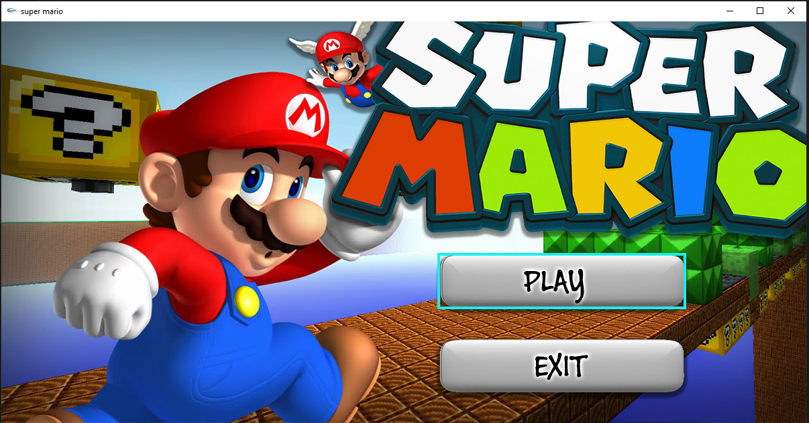
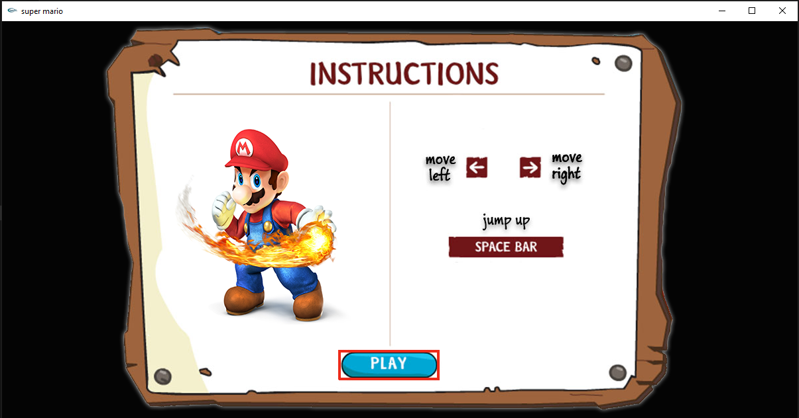
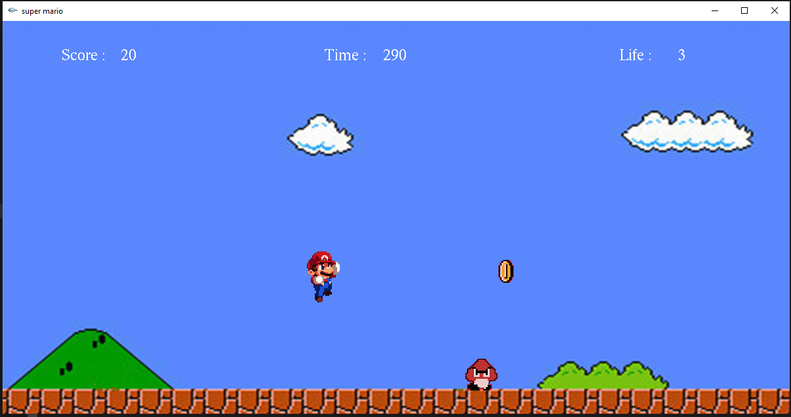
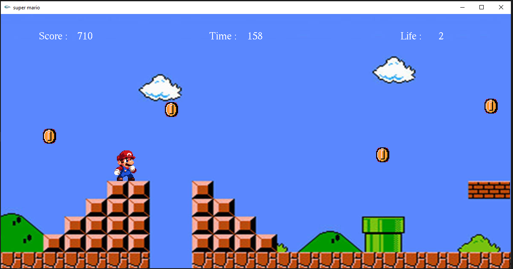

# Super_Mario
In childhood I used to play this game on TV. Then in 2017 I made this game in just 3day. There is a very interesting incident related to this project(Don't wanna share). But I don't know how this came about. 3days of sleepless nights and bunk classes this project  has made. 

## Project description
Name: Super Mario  
Programming Language: C & C++  
GUI: iGraphics  
Project No: 5  
Year: late 2017

## Demo Video

## Screen shot
### Homescreen
 

### Instruction Page
 

### Game Window
 

 

### GameOver
 

## Authors

* **AbirHasan**

Check out my other works [@XAbirHasan](https://github.com/XAbirHasan)
